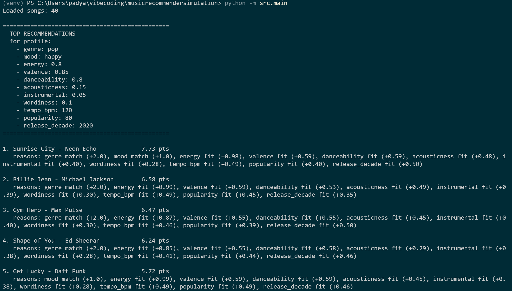

# 🎵 Music Recommender Simulation

## Project Summary

In this project you will build and explain a small music recommender system.

Your goal is to:

- Represent songs and a user "taste profile" as data
- Design a scoring rule that turns that data into recommendations
- Evaluate what your system gets right and wrong
- Reflect on how this mirrors real world AI recommenders

Replace this paragraph with your own summary of what your version does.

In summary, this program is a music recommender that uses rule to prioritize the best option for the user.

## How The System Works

Explain your design in plain language.
My design is a simple approach at making a music recommender. Music platforms in the real world tend to combine core-based filtering and content-based filtering to give the best option to the user. This program is a modest, but effective way to duplicate a more realistic platform like Youtube Music. My system will be more biased towards the genre and tempo though. In my experience, playing an upbeat hip hop song with sad themes to follow up another upbeat hip hop song that has happy themes at a party, it makes for a less brutal disruption to the dance moves and the state of mind.

Some prompts to answer:

- What features does each `Song` use in your system
  - For example: genre, mood, energy, tempo
Each song presents features like the genre, mood, tempo, and energy that help categorize it in an algorithm.

- What information does your `UserProfile` store
This stores information about the preferences input by the user. Maybe the listener is a pop fan or maybe they want a energyzed beat for the gym. That information is collected in the UserProfile to tailor the recommendations to that. 

- How does your `Recommender` compute a score for each song
The recommender computes a weighted final numerical value to both score and rank the songs in the list of recommendations. There are two different formulas at play that first measure how much of a good match a song is, then a decision maker for the actual song.
The core ide is that each song uses the single numerical score by adding different components, the song attributes, multiplied by a weight. 

- How do you choose which songs to recommend

You can include a simple diagram or bullet list if helpful.

My recommender, while using a weighted score to combine core-based filtering and content-based filtering, might prioritize genre and tempo. A genre match will be a stronger signal than a mood match.

---

## Getting Started

### Setup

1. Create a virtual environment (optional but recommended):

   ```bash
   python -m venv .venv
   source .venv/bin/activate      # Mac or Linux
   .venv\Scripts\activate         # Windows

2. Install dependencies

```bash
pip install -r requirements.txt
```

3. Run the app:

```bash
python -m src.main
```

### Running Tests

Run the starter tests with:

```bash
pytest
```

You can add more tests in `tests/test_recommender.py`.

---

## Sample Recommendation Output

Paste a sample of your recommender's output here as a text block so a reader can see what it produces:
Loaded songs: 20

================================================
  TOP RECOMMENDATIONS
  for: genre=pop, mood=happy, energy=0.8
================================================

1. Sunrise City - Neon Echo             3.98 pts
   reasons: genre match (+2.0), mood match (+1.0), energy fit (+0.98)

2. Gym Hero - Max Pulse                 2.87 pts
   reasons: genre match (+2.0), energy fit (+0.87)

3. Rooftop Lights - Indigo Parade       1.96 pts
   reasons: mood match (+1.0), energy fit (+0.96)

4. Despecha - Rosalia                   1.00 pts
   reasons: energy fit (+1.00)

5. Titi Me Pregunto - Bad Bunny         0.95 pts
   reasons: energy fit (+0.95)

```
# e.g.:
# User profile: genre=indie, mood=chill, energy=low
# Recommendations:
#   1. ...
#   2. ...
#   3. ...
```

**Screenshot or video** *(optional)*: <!-- Insert a screenshot or demo video link here -->


---

## Experiments You Tried

Use this section to document the experiments you ran. For example:

- What happened when you changed the weight on genre from 2.0 to 0.5
- What happened when you added tempo or valence to the score
- How did your system behave for different types of users
I ran all of these against the 40 song catalog with the example of a profile with Pop and Happy as a baseline. I lowered the general weight from 2.0 to 0.05 and all of the top results were from the pub genre. When I dropped it to 0.5 that led non pop songs to come up so the audio features like the mood could climb. So the general says how strict about genera the model can be. I added features like tempo violins popularity release decade into the scoring system.

---

## Limitations and Risks

Summarize some limitations of your recommender.

Examples:

- It only works on a tiny catalog
- It does not understand lyrics or language
- It might over favor one genre or mood

The limitations I can think of at the moment or from the tiny data set because the catalog of songs is small at the moment. I just have 40 songs with many genres that spin across cultures in They appear just once or twice. A user whose taste is one of those generous that appeared just once like classical, metal, a piano, soca They get just one single option and some type of filler for the other score. So for the lyrics or the language of the songs the model doesn't really have an understanding of the semantics. The worthiness feature just represents a number, the system doesn't actually assess what the song is about or what language it is in and this might be an important decision making factor for a user that's looking for a specific theme or a specific language. Some generals tend to dominate the ranking just because of the genera so there's like a bias there. 

---

## Reflection

Read and complete `model_card.md`:

[**Model Card**](model_card.md)

Write 1 to 2 paragraphs here about what you learned:

 Building this model made it more clear how a recommender turns data into predictions. It takes human preferences into numbers maybe even matrices to make a scoring system for each item on a list. There are fixed rules to classify them sort the songs. The intelligent part of the machine is the recipe for the algorithm. Basically how we choose to weight the features is what affects the models results directly. Adding reasons to each recommendations also change how I think about these systems. Because you can explain the thought process behind the result.


